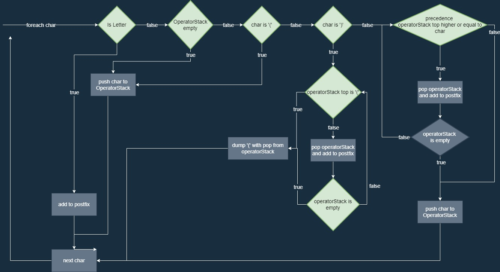
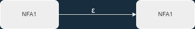

# UIMethods

UIMethods is a project for the course formal methods. The goal was to make a GUI that gives the possibility for the user to type in a regex and to test it using the application. For this to be useful, the regex must be converted into a NFA and eventually DFA. This way the user can easily test what the DFA accepts or not. As a side note, the application is made using C# and WPF. The contents of this document are:
* Usage
* Theory

Any questions or feedback? [Contact me!](mailto:ralf@van-aert.nl)

## Usage

The layout of the application is rather simple: you have a input box at the top, a bunch of buttons to the left and at the bottom there is another input box and a test button. In the middle of the application is the textblock located for the application to give feedback about the process.  
First of all, the user types in the regex into the box and clicks on 'Check' to check if it's an accepted regex, see below.

After that the user can push postfix to create the postfix, which is shown. When the postfix is created it can be converted to a NFA and lastly a DFA, see both below

For further explaination how the conversion works see the theory section. There is one important feature to note here: the trapstate that is created in the conversion to DFA. To create a valid DFA every input may not, in any circumstance, lead to a dead end. Thus this trapstate is created, see state S6 looping back at itself with every symbol.
 
Lastly testing the acceptor is done with the input box at the bottom.

## Theory
For this project numerous theories are used. It's important to note that the automaton (N)DFA contains everything:
* Alphabet
* States
    * Startstate(s)
    * Finalstate(s)
* Transitions
    * From state
    * Symbol/epsilon
    * To state

These make up the automaton, but first you must create an automaton. For this the following theories are used:
* Shunting-Yard Algorithm
    * Concatenation for preparation
    * Creates postfix ([Reverse Polish Notation](https://en.wikipedia.org/wiki/Reverse_Polish_notation))
* Thompson Construction
    * Iterate over postfix, creates NFA
* Equivalence NFA to DFA
    * Conversion from NFA to DFA
* Acceptor for regex
    * NFA to accept regex in this GUI

This theory will be a short summarary of the code, but will not include everything. For more explanation, check the code with commentary, consult the internet for theory or [contact me](mailto:ralf@van-aert.nl).
 
 

## Shunting-Yard algorithm
The Shunting-Yard algorithm is used to get rid of parenthesis and arange the regex in such a way that the Thompson Construction can iterate over it from front to back. In this case the characters precede the operators. There is only one preparation to be done before the Shunting-Yard algorithm and that is concatenation.  
Concatenation is normally not shown in a regex. This is because consecutive characters or regex(-parts) are already assumed concatenated if no other operators are applied. For example 'ab' is actually 'a' and 'b' concatenated. For this algorithm '?' is used as concat symbol. The concatenation algorithm won't be discussed, but it works neatly.
Take 'a(a|b)\*b' for example, in this case the concatenation algorithm creates the concatenated regex: 'a?(a|b)\*?b'. This is done because it glues all the regex parts together. 
How this algorithm works can be found in this flow diagram.
 

 

In this flow diagram I want to highlight two parts: the section below the "char is ')' " and "precedence operatorStack top higher or equal to char". The first tackles a closing parenthesis case, which is a finishing regex(-part), thus every operator gets pushed until parenthesis opened is found again in stack. The second part is to handle the precedence of operators. This is very similar as to how precedence in mathematics works with '+', '×' and '^2'. The operators in question with their precedence are:

| Operator | Symbol | Precedence |
| -------- | ------ | ---------- |
| Star | * | 2 |
| Plus | + | 2 |
| Concat | ? | 1 |
| Or | \| | 0 |

This rounds up the working of the Shunting-Yard algorithm.

 

## Thompson construction
The Thompson Construction is loosely used here. The part used is to create NFA's for different scenarios. Each scenario has a different solution:
* Symbol
 
* Or-operator
 
* Concatenation
 
* Star-operator
 
* Plus-operator
 
 

Every scenario is used in the algorithm. This algorithm iterates from front to back over the postfix and acts accordingly, as shown in the flow diagram below. 

 

 
 

## Equivalence NFA to DFA
To convert the NFA generated by the Thompson Construction, methods are used to determine epsilon closures and which symbols go to which states. This all starts with the start state:
* Check for each letter in alphabet what possible go to states are (incl. epsilon)
* Add transition to this group of states and push the group of states to the stack
* Nowhere to go? To the trapstate for this symbol
* Repeat if there are (group of) states on the stack

 
Lastly all states are scanned if they contain the previous final state and if so are defined final state. This is the algorithm explained in its simplest of forms possible, since on the big scale it's not that difficult. After all that, all states are ought to be renamed, which is implemented within the Automaton class.

 
 

## Acceptor for regex
Originally I had to use a extern library to check wether or not the regex given was valid, but since I finished my own acceptor I use mine. Only thing I didn't realise at the time was that things could get difficult. This is because my logic doesn't allow for recursion, which isn't a problem until you want to allow as much parenthesis as possible. So I chose for a way to allow n-depth of parenthesis. In the figure below my NFA is presented, which is, essentially, consistent of 3 parts: twice a regex acceptor and a part bridging them with parenthesis. This can be done n-amount of times (current implementation, n = 3). For every n + 1 the parenthesis bridge is created to a new part. After creating this logic I convert the NFA to a DFA using previous logic and you have a working regex acceptor. Only downfall being in this case that you can only have n-amount parenthesis. Still a worthy solution for the application.
 
